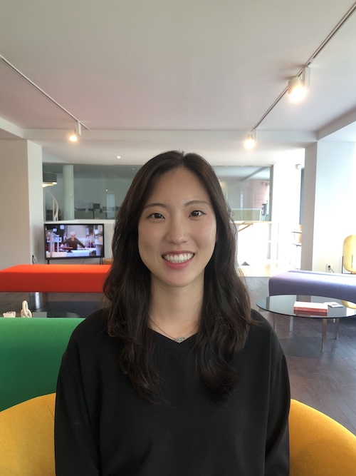

  

# Minjin Chae

PhD Candidate, Harvard University, Department of Sociology

email: **minjinchae@g.harvard.edu**

I study how individual decisions and behaviors regarding work and family, often perceived as voluntary and rational, are in fact deeply embedded in social structures and norms. My projects ask whether workplace flexibility shifts gendered domestic expectations, how occupational segregation produces gender and racial inequality in remote work, and how organizational configurations mediate the effects of flexibility and childcare policies. I use quantitative methods with administrative, survey, and experimental data from the United States, Germany, and South Korea.

Here's [my CV](Chae_CV.pdf).

## Publications

<ul class="publications">
  <li>Yun, Youngho, Yeani Choi, and Minjin Chae. 2021. "Development and Validity Testing of the Workplace Parentship Index (WPI): Assessment of Family-Friendly Practices." <i>Journal of Occupational and Environmental Medicine</i> 63(12).</li>
</ul>

## Working papers

<ul class="publications">
  <li>Chae, Minjin. "When Does Gender Trump Flexibility? Workplace Flexibility and Domestic Labor Expectations." Under review.</li>
</ul>

## Work in progress

<ul class="publications">
  <li>Chae, Minjin. "Occupational Segregation and the Structure of Intersectional Inequality in Remote Work, 2017&ndash;2026."</li>
  <li>Chae, Minjin. "When Do Firms Reduce or Reproduce Gender Inequality? Organizational Contexts of the Pandemic Work From Home and KiF&ouml;G Childcare Expansions."</li>
  <li>Cha, Youngjoo, Kaitlin Johnson, and Minjin Chae. "Why Is the Gender Wage Gap Larger in Some Occupations than Others? Work Hours, Task Flexibility, and the Gender Wage Gap Across Occupations."</li>
  <li>Chae, Minjin. "Gender Essentialist Norms and Skeptical Attitudes Toward Marriage Among South Korean Young Adults."
    <ul class="award">
      <li>International Conference on Sociology of Korea Student Paper Award, University of Pennsylvania Kim Center for Korean Studies, 2022</li>
      <li>Best Graduate Student Paper Award, The Population Association of Korea, 2019</li>
    </ul>
  </li>
</ul>

